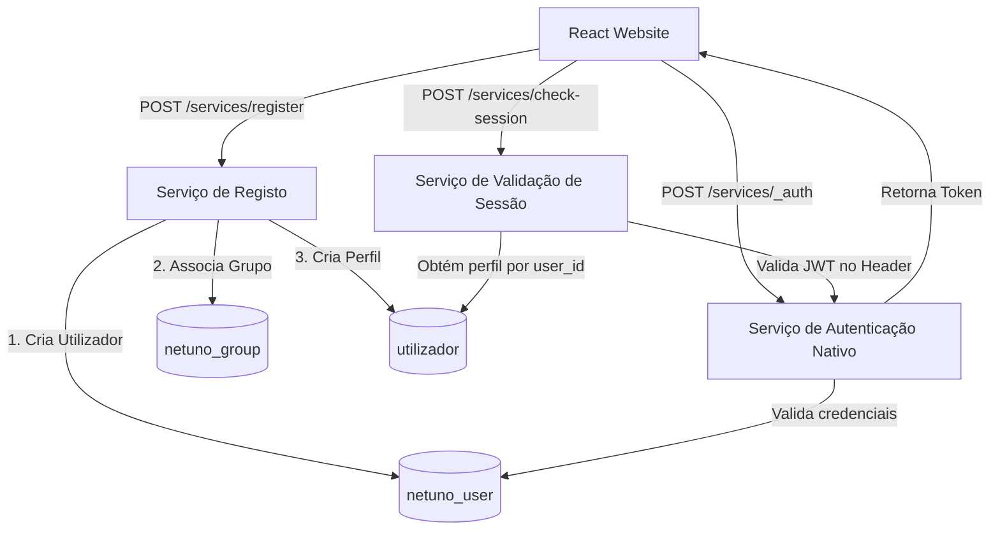
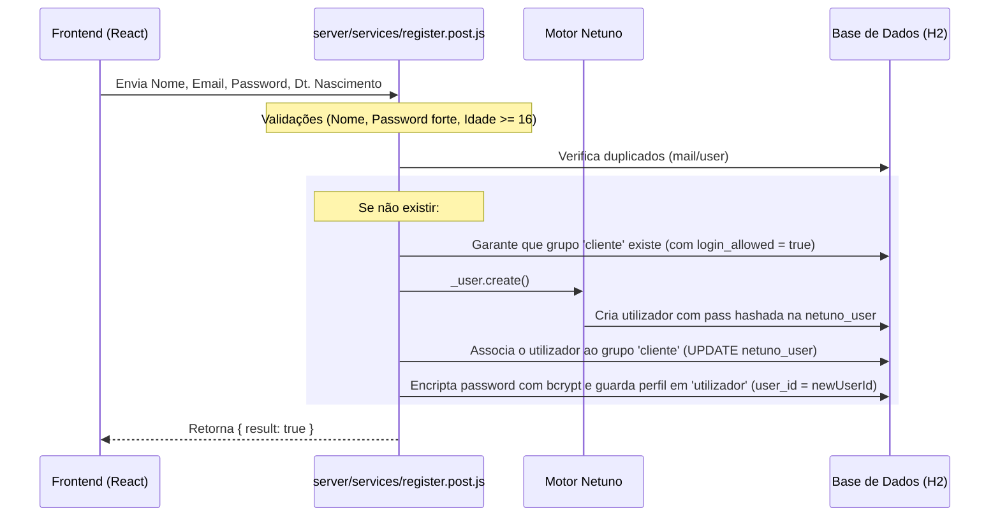
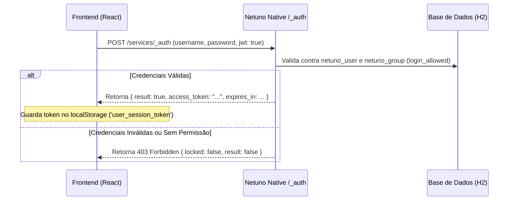
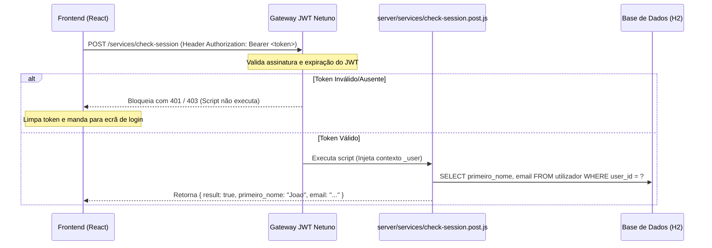

# 🔐 Documentação do Fluxo de Autenticação (Deliberatis)

Este documento detalha o funcionamento do sistema de autenticação do **Deliberatis**, baseado no mecanismo nativo de **JSON Web Token (JWT)** e recursos de utilizadores do framework **Netuno**.

---

## 🗺️ Visão Geral da Arquitetura

O sistema de autenticação é integrado, ligando a interface React ao motor de segurança nativo do Netuno e a uma tabela customizada de perfil no H2:



---

## 📁 Ficheiros Envolvidos

*   **Configuração:**
    *   [`config/_development.json`](file:///home/joao_inacio/netuno/apps/deliberatis/config/_development.json): Configuração do segredo e expiração do JWT.
*   **Serviços Backend:**
    *   [`server/services/register.post.js`](file:///home/joao_inacio/netuno/apps/deliberatis/server/services/register.post.js): Processa o registo de novos utilizadores.
    *   [`server/services/check-session.post.js`](file:///home/joao_inacio/netuno/apps/deliberatis/server/services/check-session.post.js): Valida a sessão ativa do utilizador.
*   **Componentes Frontend:**
    *   [`website/src/containers/AuthContainer/register.jsx`](file:///home/joao_inacio/netuno/apps/deliberatis/website/src/containers/AuthContainer/register.jsx): Ecrã de Registo.
    *   [`website/src/containers/AuthContainer/login.jsx`](file:///home/joao_inacio/netuno/apps/deliberatis/website/src/containers/AuthContainer/login.jsx): Ecrã de Login.
    *   [`website/src/containers/HomeContainer/index.jsx`](file:///home/joao_inacio/netuno/apps/deliberatis/website/src/containers/HomeContainer/index.jsx): Dashboard Principal (onde a sessão é validada).

---

## 1. ⚙️ Configuração do JWT no Netuno

A autenticação utiliza o suporte nativo a JWT do Netuno. Está ativado em `config/_development.json`:

```json
"auth": {
  "jwt": {
    "enabled": true,
    "secret": "MinhaChaveSecretaDeliberatisSuperSegura123!",
    "expires": {
      "access": 1440,
      "refresh": 1440
    }
  }
}
```

*   **`secret`**: Chave secreta usada para assinar digitalmente os tokens e garantir a sua autenticidade.
*   **`expires`**: Tempo de vida dos tokens (em minutos).

---

## 2. 📝 Fluxo de Registo (Sign Up)

O registo cria um utilizador do sistema Netuno e, simultaneamente, cria um perfil correspondente na tabela customizada `utilizador`.



### Detalhes do Registo Backend
O script [`register.post.js`](file:///home/joao_inacio/netuno/apps/deliberatis/server/services/register.post.js) faz o seguinte:
1.  **Validações**: Garante que o utilizador tem pelo menos 16 anos e que o nome e password cumprem as regras de força e formato.
2.  **Verificação de Duplicado**: Garante que o email ou utilizador não existem previamente em `netuno_user`.
3.  **Grupo de Acesso**: Procura ou cria o grupo com o código `"cliente"` via SQL com `"login_allowed" = true` para garantir que o utilizador consiga entrar.
4.  **Criação do Utilizador Nativo**: Usa `_user.create(...)` para criar o utilizador no Netuno. O Netuno gera automaticamente o hash seguro da password.
5.  **Associação de Grupo**: Atualiza a tabela `netuno_user` para ligar o utilizador ao ID do grupo `"cliente"`.
6.  **Criação do Perfil**: Encripta a password usando o recurso `_crypto` (bcrypt) para respeitar o constrangimento obrigatório da tabela customizada `utilizador`, e insere o perfil relacionando com a coluna `user_id` correspondente.

---

## 3. 🔑 Fluxo de Login & Obtenção do Token

O login delega a validação diretamente ao serviço nativo e otimizado do Netuno: `/_auth`.



### Detalhes do Login
*   No frontend, o ficheiro [`login.jsx`](file:///home/joao_inacio/netuno/apps/deliberatis/website/src/containers/AuthContainer/login.jsx) submete os dados de login:
    ```javascript
    _service({
      url: '/_auth',
      method: 'POST',
      data: {
        username: values.email, // Netuno usa a coluna 'user'
        password: values.password,
        jwt: true
      },
      // ...
    ```
*   Ao obter sucesso, o token é guardado e o utilizador é redirecionado para `/public/home.html`.

---

## 4. 🛡️ Fluxo de Validação de Sessão (check-session)

Uma vez com o token, todas as comunicações privadas são protegidas usando o Header HTTP `Authorization`.



### Detalhes da Validação
1.  **Interceção Automática**: Como o serviço [`check-session.post.js`](file:///home/joao_inacio/netuno/apps/deliberatis/server/services/check-session.post.js) é privado por padrão no Netuno, o gateway do framework valida a assinatura criptográfica e validade do token passado no header HTTP `Authorization: Bearer <token>` antes de correr o script.
2.  **Utilizador Autenticado**: Se o token for válido, o Netuno expõe a informação do utilizador autenticado no recurso `_user` (como `_user.id()`).
3.  **Procura do Perfil**: O script faz uma query à tabela `utilizador` para obter dados complementares (como o `primeiro_nome` e `email` do perfil do utilizador) e responde ao cliente:
    ```javascript
    const userId = _user.id();
    const userQuery = _db.query(
      "SELECT primeiro_nome, email FROM utilizador WHERE user_id = ? AND active = true",
      userId
    );
    if (userQuery.size() > 0) {
      const user = userQuery.get(0);
      _out.json(_val.map()
        .set("result", true)
        .set("email", user.getString("email"))
        .set("primeiro_nome", user.getString("primeiro_nome"))
      );
    }
    ```
4.  Se o `/check-session` falhar, o frontend executa o método `logout()`, que limpa os tokens salvos e envia o utilizador de volta para o formulário de login de forma segura.
