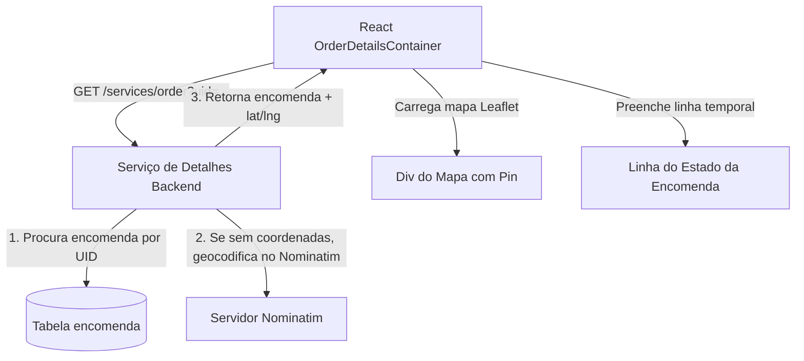

# Documentação do Fluxo de Detalhes da Encomenda (Deliberatis)

Este documento descreve o funcionamento do ecrã de detalhes da encomenda, a integração do mapa Leaflet para visualização estática do endereço de entrega, a resolução de geocodificação no backend e as regras de negócio associadas aos botões e ao link de rastreio.

---

## 1. Visão Geral da Arquitetura do Ecrã de Detalhes

A página de detalhes é acedida através da rota `/public/order-details.html?uid={uid}`, onde o parâmetro `uid` corresponde ao identificador único hexadecimal da encomenda.

---

## 2. Serviço Backend de Detalhes (`/services/order`)

O ficheiro [`server/services/order/get.js`](file:///home/joao_inacio/netuno/apps/deliberatis/server/services/order/get.js) é responsável por fornecer os dados completos de uma única encomenda.

### Funcionalidades do Backend:
1. **Validação da Sessão**: Garante que o utilizador possui um token JWT ativo.
2. **Filtro de Segurança**: Restringe a consulta para assegurar que o utilizador autenticado apenas pode aceder a encomendas criadas por si próprio.
3. **Geocodificação Automática no Servidor**:
   - Caso a encomenda ainda não possua coordenadas geográficas (`latitude`, `longitude`) gravadas, o backend concatena a rua, a cidade e o país e realiza uma chamada para a API externa Nominatim.
   - Os valores de latitude/longitude retornados são guardados na base de dados H2 (atualizando o registo da encomenda) para consultas futuras mais rápidas.
4. **Retorno**: Envia um JSON contendo os dados estruturados da morada, valores monetários, contacto, observações e coordenadas geográficas da entrega.

---

## 3. UI Frontend (`website/src/containers/OrderDetailsContainer/index.jsx`)

O componente `OrderDetailsContainer` coordena a interface e o carregamento dos seguintes blocos principais:

### 3.1. Linha Temporal de Estado (Timeline/Steps)
- Apresenta de forma visual o estado de progressão em que a encomenda se encontra.
- Traduz o estado em três marcos consecutivos:
  1. **Submetida** (Estado: `Pendente` / Index `0`)
  2. **Em Trânsito** (Estado: `Em Trânsito` / Index `1`)
  3. **Entregue** (Estado: `Entregue` / Index `2`)

### 3.2. Cartão de Detalhes (Informação Geral)
- **Data do Pedido**: Formatada como `DD/MM/YYYY HH:mm:ss`.
- **Preço**: Exibido formatado com duas casas decimais e símbolo monetário (ex: `15.50€`).
- **Telemóvel & Método de Pagamento**: Exibe os valores inseridos pelo cliente.
- **Observações**: Apresentadas num bloco destacado caso tenham sido especificadas na criação.
- **Link de Rastreio**:
  - Se a encomenda estiver no estado **Pendente**: Mostra a mensagem em vermelho: *"Link indisponível (a encomenda ainda está pendente)"*.
  - Se a encomenda estiver nos estados **Em Trânsito** ou **Entregue**: Mostra um link clicável redirecionando para: `https://tracking.deliberatis.pt/order/{uid}`.

### 3.3. Cartão de Morada de Entrega & Mapa Leaflet
- Exibe o endereço completo: Rua, Número da Porta, Andar/Fração (obrigatório), Código Postal e Cidade.
- Integra o **mapa Leaflet** que lê as coordenadas lat/lng retornadas pelo backend e coloca automaticamente um marcador azul no ponto exato de entrega com um popup interativo: *"Morada de Entrega"*.

### 3.4. Botões de Ação
- **Voltar**: Botão primário azul que redireciona de volta para `/public/home.html`.
- **Editar**:
  - O botão de edição apenas se encontra **ativo** quando o estado da encomenda é **Pendente**.
  - Caso a encomenda tenha passado para os estados **Em Trânsito** ou **Entregue**, o botão é desativado visualmente (`disabled`), impedindo qualquer alteração de dados.
