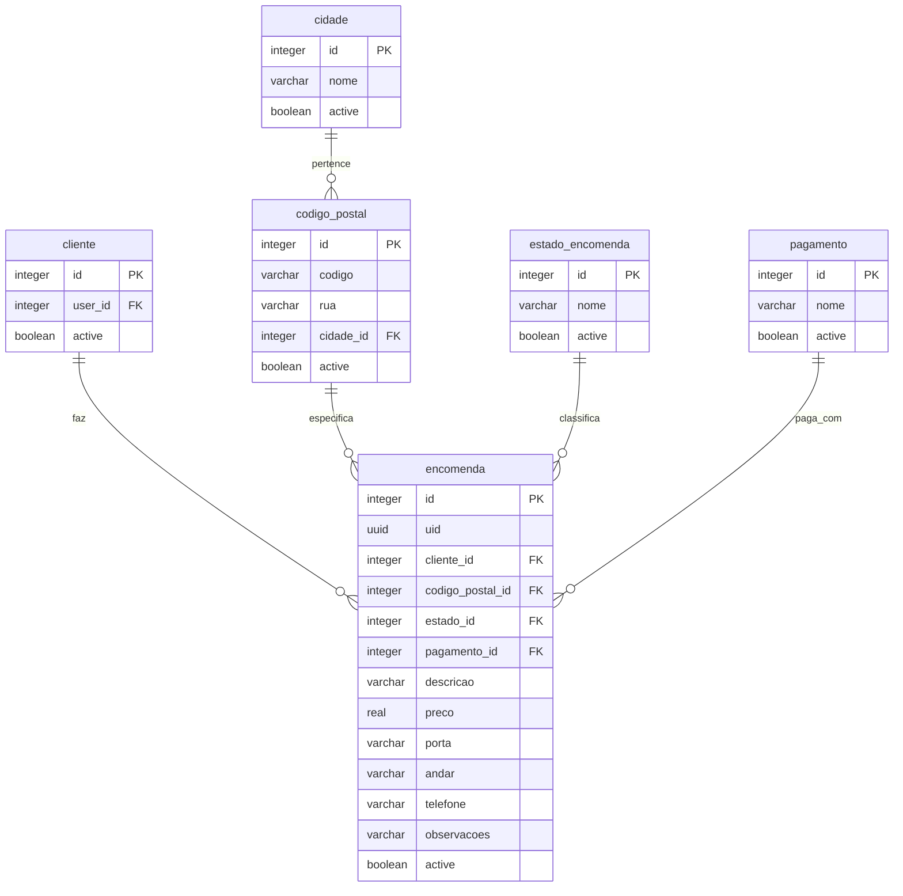

# Documentação do Fluxo de Encomendas (Deliberatis)

Este documento descreve detalhadamente o funcionamento da criação, listagem e persistência de encomendas na base de dados H2 utilizando o controlo de sessão JWT nativo do Netuno no projeto **Deliberatis**, incluindo a normalização de estados de encomendas, o sistema de códigos postais e a integração do mapa interativo.

---

## 1. Arquitetura da Base de Dados Normalizada

A estrutura das tabelas foi desenhada para otimizar espaço em disco e evitar redundâncias de dados. As moradas estão estruturadas e normalizadas através de tabelas relacionadas para códigos postais e cidades (distritos):

### Detalhe das Tabelas Principais:
- **`encomenda`**: Armazena os itens da encomenda (`descricao`), o `preco`, a `porta`, o `andar` (obrigatório), o `telefone` de contacto, e as chaves estrangeiras para o cliente, código postal, estado e método de pagamento.
- **`codigo_postal`**: Mapeia o código postal (`codigo` no formato `XXXX-XXX`) com a respetiva `rua` e `cidade_id`.
- **`cidade`**: Registo das cidades/distritos (normalizado com os 18 distritos de Portugal).
- **`estado_encomenda`**: Estados possíveis (ex: "Pendente", "Em Trânsito", "Entregue").
- **`pagamento`**: Métodos suportados (ex: "MBWay", "Dinheiro na Entrega", "Cartão de Crédito/Débito").

---

## 2. Integração com o Mapa Interativo & Geocodificação (Arquitetura Backend)

Para garantir a precisão geográfica na seleção de moradas sem depender de APIs externas pagas ou instáveis, integrámos o **Leaflet Map** (com dados OpenStreetMap).

Para maior segurança, privacidade e robustez, todas as consultas à API Nominatim externa são delegadas e executadas a partir do **backend do Netuno**:

- **`/services/map-search`** (`server/services/map-search/get.js`): Pesquisa localizações geográficas em Portugal a partir do servidor.
- **`/services/map-reverse`** (`server/services/map-reverse/get.js`): Efetua reverse geocoding a partir do servidor para converter coordenadas em moradas físicas.
- **`/services/postal-code`** (`server/services/postal-code/get.js`): Processa a validação de códigos postais. Verifica primeiro na base de dados H2 (cache local). Se não existir, faz a consulta externa ao Nominatim do lado do servidor, valida os dados, guarda na base de dados (cache automática) e devolve a morada resolvida.

O frontend comunica diretamente com estes serviços backend através do cliente de serviços nativo `_service` do Netuno dentro de `HomeContainer`.

### Arquitetura Frontend Modularizada:
Para manter o projeto organizado e de fácil manutenção, o ecrã principal foi dividido em componentes focados:

1. **`HomeContainer`** (`website/src/containers/HomeContainer/index.jsx`):
   - Atua como o controlador leve que gere o estado centralizado, a validação de sessão e as chamadas de API (serviços do Netuno).
2. **`OrdersTable`** (`website/src/components/OrdersTable/index.jsx`):
   - Apresenta a tabela das encomendas efetuadas.
   - Aplica a formatação de data para o formato português: `dia/mês/ano` (ex: `DD/MM/YYYY HH:mm:ss`).
   - Implementa a lógica visual para representação dos estados de entrega com uma bolinha indicadora ("dot"):
     - **Pendente**: Cor laranja e uma bolinha laranja a pulsar (`dot-pulse-orange`).
     - **Em Trânsito**: Cor azul e uma bolinha azul a pulsar (`dot-pulse-blue`).
     - **Entregue**: Cor verde com uma bolinha estática verde (`dot-static-green`).
   - Renders the primary action button **"Mais Detalhes"** styled in primary blue (`#5b5ce1`, bold, rounded borders).
3. **`CreateOrderModal`** (`website/src/components/CreateOrderModal/index.jsx`):
   - Gere o formulário de introdução de dados de encomendas e validação em tempo real de código postal.
4. **`MapModal`** (`website/src/components/MapModal/index.jsx`):
   - Encapsula o mapa do Leaflet e a caixa de pesquisa local para geocodificação.

### Funcionalidades do Frontend:
1. **Limitação a Portugal**:
   - Os limites de arrastamento do mapa (`maxBounds`) e o zoom mínimo (`minZoom`) estão configurados no `MapModal` para reter o foco em Portugal continental e ilhas.
   - Qualquer pesquisa realizada restringe os resultados ao país usando o parâmetro `&countrycodes=pt` no backend.
2. **Validação Fora de Portugal**:
   - Cliques em localizações estrangeiras (ex: Espanha, oceano) disparam um aviso informativo (*"Não podes selecionar uma morada fora de Portugal"*) e removem o pin (marcador azul) do mapa.
3. **Validação Inteligente de Código Postal**:
   - Ao digitar um código postal de 8 caracteres, o componente `/components/CreateOrderModal` despoleta a consulta ao backend `/services/postal-code` gerido pelo contentor. O backend faz a pesquisa e validação em cache/internet e retorna os dados de rua e distrito. Caso o código seja inválido, o frontend apresenta a validação a vermelho com o ícone correspondente.
4. **Geocodificação Inteligente ao Abrir o Mapa**:
   - Quando o utilizador abre o mapa, caso já tenha dados preenchidos, o mapa geocodifica essa informação instantaneamente, coloca o pin azul e foca o mapa nessa localização.
5. **Confirmação Obrigatória do Pin ao Submeter**:
   - Ao clicar em "Submeter Encomenda", o sistema intercepta o envio e abre sempre o modal do mapa, solicitando ao utilizador que confirme visualmente a morada através do pin azul e clique em "Confirmar Localização" antes de enviar para o servidor.

---

## 3. Fluxo de Criação de Encomenda

1. **Validação**: O utilizador preenche o formulário e confirma a localização do pin azul. O campo **Andar / Fração** é de preenchimento obrigatório no frontend para consistência com o esquema de base de dados.
2. **Submissão**: O React efetua um pedido POST para `/services/orders` com o token JWT no cabeçalho `Authorization`.
3. **Gravação**:
   - O backend (`server/services/orders/post.js`) obtém o utilizador autenticado (`_user.id()`) e o seu perfil de cliente.
   - Se o código postal não existir na base de dados, cria o registo dinamicamente em `codigo_postal` (e opcionalmente a `cidade` se for nova).
   - Efetua a inserção na tabela `encomenda` relacionando todas as tabelas.

---

## 4. Fluxo de Listagem de Encomendas

- **Frontend**: Envia um pedido GET para `/services/orders`. Apresenta as encomendas do cliente utilizando o prefixo `#` seguido dos primeiros 8 caracteres do `uid`.
- **Backend (`server/services/orders/get.js`)**: Executa uma query com `LEFT JOIN` nas tabelas `encomenda` e `estado_encomenda` para devolver o nome do estado textual correspondente (ex: "Pendente") compatível com o frontend.
