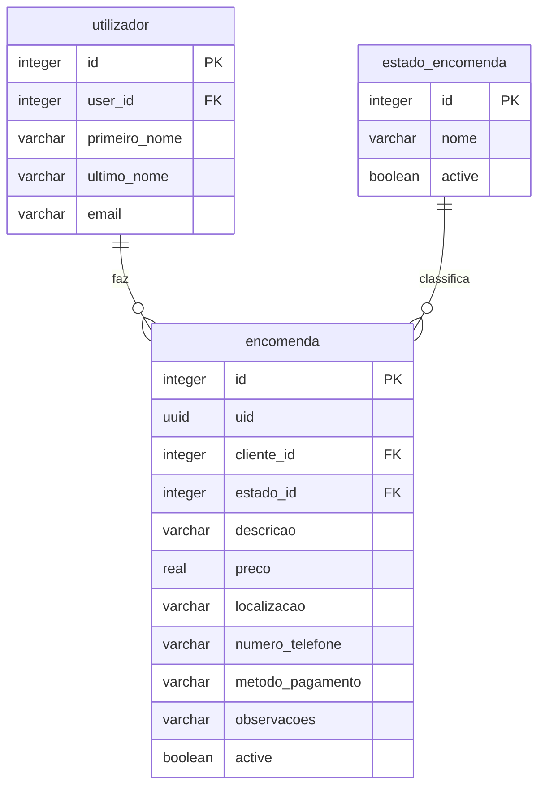

# Documentação do Fluxo de Encomendas (Deliberatis)

Este documento descreve detalhadamente o funcionamento da criação, listagem e persistência de encomendas na base de dados H2 utilizando o controlo de sessão JWT nativo do Netuno no projeto **Deliberatis**, incluindo a normalização de estados de encomendas.

---

## 1. Arquitetura da Base de Dados Normalizada

Para otimizar o espaço em disco e evitar redundância de strings (como ter milhares de registos a repetir "Pendente" ou "Entregue"), o estado das encomendas foi normalizado através de uma tabela de relação dedicada:

### Colunas da Tabela `encomenda`:
*   `id (integer)`: Chave primária.
*   `uid (uuid)`: Identificador único público (UUID) exibido no frontend.
*   `cliente_id (integer)`: Chave secundária ligando com `id` da tabela `utilizador`.
*   `estado_id (integer)`: Chave secundária ligando com `id` da tabela `estado_encomenda`.
*   `descricao (character varying)`: Descrição dos itens da encomenda.
*   `preco (real)`: Preço final.
*   `localizacao (character varying)`: Endereço de entrega.
*   `numero_telefone (character varying)`: Contacto de telemóvel.
*   `metodo_pagamento (character varying)`: Método de pagamento.
*   `observacoes (character varying)`: Notas opcionais.
*   `active (boolean)`: Flag de registo ativo (`true`).

### Colunas da Tabela de Relação `estado_encomenda`:
*   `id (integer)`: Chave primária (ex: 1, 2, 3).
*   `nome (character varying)`: Nome descritivo (ex: "Pendente", "Em Trânsito", "Entregue").
*   `active (boolean)`: Flag de registo ativo.

---

## 2. Fluxo de Criação de Encomenda

### Frontend (`website/src/containers/HomeContainer/index.jsx`)
*   O utilizador preenche o formulário no modal de criação.
*   Ao submeter, o React lê o token de sessão do `localStorage` e envia os dados num pedido POST para `/services/orders` com o token no Header `Authorization: Bearer <token>`.

### Backend (`server/services/orders.post.js`)
*   **Controlo de Acesso & Identificação**:
    *   O Netuno valida a assinatura e expiração do JWT enviado no cabeçalho.
    *   No script JS, acedemos ao ID do utilizador ativo através do recurso nativo `_user.id()`.
*   **Mapeamento de Perfil**:
    *   Pesquisa na tabela `utilizador` o ID do perfil correspondente ao `user_id` do Netuno.
*   **Associação de Estado Dinâmica**:
    *   Pesquisa o ID correto correspondente ao estado "Pendente" na tabela `estado_encomenda` (ex: `id = 1`).
    *   Insere a encomenda gravando a chave secundária `estado_id` em vez do texto plano, poupando espaço.

---

## 3. Fluxo de Listagem de Encomendas

### Frontend (`website/src/containers/HomeContainer/index.jsx`)
*   Ao aceder à página inicial, o frontend faz um pedido GET para `/services/orders` com o token no Header `Authorization: Bearer <token>`.
*   Renderiza os dados recebidos numa tabela, utilizando o `uid` (ex: `#0ba4ee4d`) como identificador público da encomenda.

### Backend (`server/services/orders.get.js`)
*   **Autenticação**: O Netuno valida o cabeçalho de autorização de forma transparente.
*   **Join de Dados**:
    *   Efetua um `LEFT JOIN` entre a tabela `encomenda` e `estado_encomenda` para ir buscar o campo `nome` do estado (ex: "Pendente").
    *   Retorna os resultados usando o alias `s.nome AS estado` para manter total compatibilidade com o frontend React sem necessidade de alterar o código do cliente.
